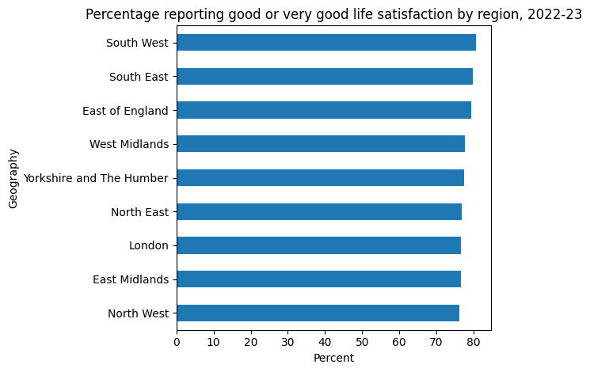

# uk-regional-wellbeing-2026 

This project uses the ONS Personal Well-being Estimates by Local Authority dataset to compare life satisfaction across England's nine regions for 2022-23. I calculated the combined percentage of respondents reporting "good" or "very-good" life satisfaction in each region using pandas. The South West reported the highest combined percentage (80.69%), while the North West reported the lowest (76.10%), a gap of 4.59 percentage points. Interestingly, London sits near the bottom (76.72%) despite its economic profile, suggesting life satisfaction doesn't track straightforwardly with regional wealth. Built with Python and pandas in Google Colab.
